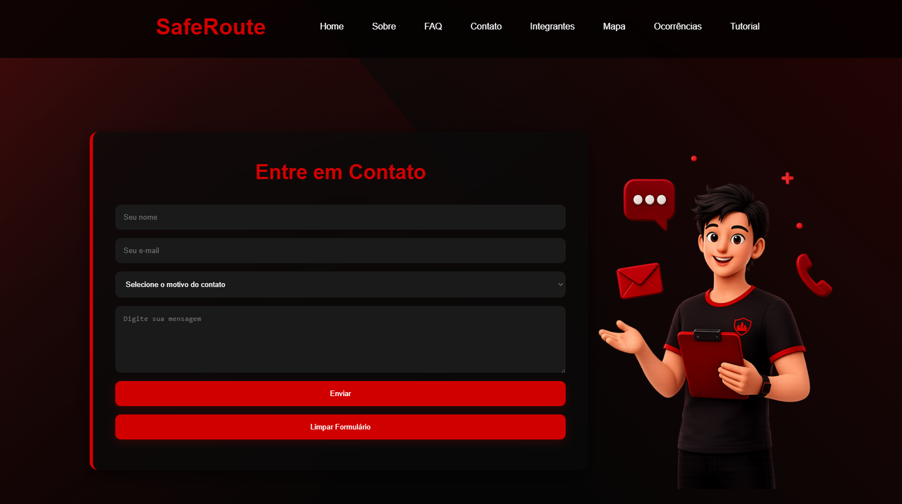
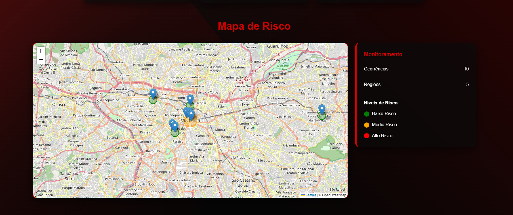
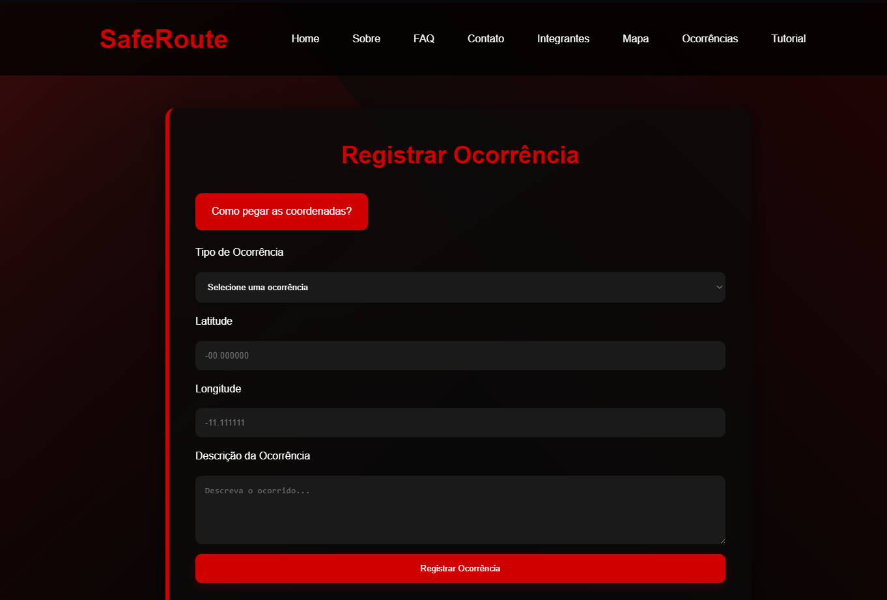

# Global Solution - Front-end - FIAP 

## Título e descrição do projeto 📌
Nome do Projeto: SafeRoute
Objetivo do Projeto: Desenvolver uma plataforma que utilize análise de dados, localização e registros de ocorrências para auxiliar usuários a encontrarem rotas mais seguras e visualizarem áreas de risco na cidade.

## Tecnologias Utilizadas 💻
    1 - HTML
    2 - CSS
    3 - JavaScript

## Estrutura de Pastas do Projeto 📂
📁 Global Solution
│
├📄 index.html → Página inicial do SafeRoute
├📄 sobre.html → Informações sobre o projeto
├📄 faq.html → Perguntas frequentes
├📄 contato.html → Formulário de contato
├📄 integrantes.html → Página com os integrantes responsáveis pelo desenvolvimento do SafeRoute
├📄 solucao.html → Página do mapa
├📄 solucao2.html → Página para registrar ocorrências no mapa
├📄 solucao3.html → Tutorial sobre como, registrar ocorrências no mapa
│
├📄 style.css → CSS do site
├📄 script.js → Funcionalidades e interações em JavaScript
│
├── 📁 img/
│   ├📄 guilherme.jpeg
│   ├📄 imagem-contato.png
│   ├📄 pedro-felipe.jpeg
│   ├📄 pedro-henrique.jpeg
│   ├📄 rafaela.jpeg
│   ├📄 tutorial1.png
│   ├📄 tutorial2.png
│   ├📄 tutorial3.png
│   ├📄 tutorial4.png
│   └📄 victor.jpeg
│
└📄 README.md → Documentação do projeto

## Autores e créditos 👥
    1 - Guilherme Joel de Camargo - RM570403 - 1TDSPK
    Github: https://github.com/guilhermejcam
    Linkedln: https://www.linkedin.com/in/guilherme-camargo-a06410410/

    2 - Pedro Felipe de Castro Rosa - RM569049 - 1TDSPK
    Github: https://github.com/Pedrin740
    Linkedln: https://www.linkedin.com/in/pedro-felipe-castro-rosa/

    3 - Pedro Henrique Cardoso Cavalcante De Souza - RM570464 - 1TDSPK
    Github: https://github.com/pedrostack-01
    Linkedln: https://www.linkedin.com/in/pedro-souza-6282333b3/

    4 - Rafaela Donadio Figueiredo Tavares - RM572797 - 1TDSPK
    Github: https://github.com/mrafahdft
    Linkedln: https://www.linkedin.com/in/rafaela-donadio-bb3740369/

    5 - Victor Ferreira Gomes - RM569273 - 1TDSPK
    Github: https://github.com/Victor180422
    Linkedln: https://www.linkedin.com/in/victor-ferreira-gomes-63b2463b5/

## Imagens e representação do projeto

A imagem abaixo, mostra onde o usuário pode entrar em contato. Além disso, o usuário informa o motivo do contato e descreve seu problema, feedback, dúvida e etc.

Na imagem abaixo, é possível ver onde o usuário pode acessar o mapa, visualizar as ocorrências em cada região e consultar o seu nível de risco.

A imagem abaixo, mostra onde e de que maneira o usuário pode fazer um registro de ocorrência via formulário.  Após o envio do formulário com todos os requisitos preenchidos, a ocorrência é adicionada ao mapa.

## Link do Repositório 🔗
https://github.com/Pedrin740/Global_Solution.git

## Contato ✉️
E-mail dos integrantes:
    1 - RM570403@fiap.com.br - Guilherme Joel de Camargo
    2 - RM569049@fiap.com.br - Pedro Felipe de Castro Rosa
    3 - RM570464@fiap.com.br - Pedro Henrique Cardoso Cavalcante De Souza
    4 - RM572797@fiap.com.br - Rafaela Donadio Figueiredo Tavares
    5 - RM569273@fiap.com.br - Victor Ferreira Gomes